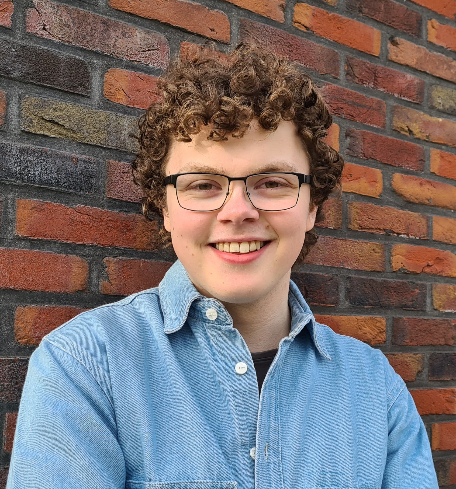

My name is Daan Noordenbos, and I am a PhD student in Operations Research at Tilburg University. My interests are probability theory, programming (especially game playing agents) and chess.

This website contains my CV, research, and an overview of my projects.
