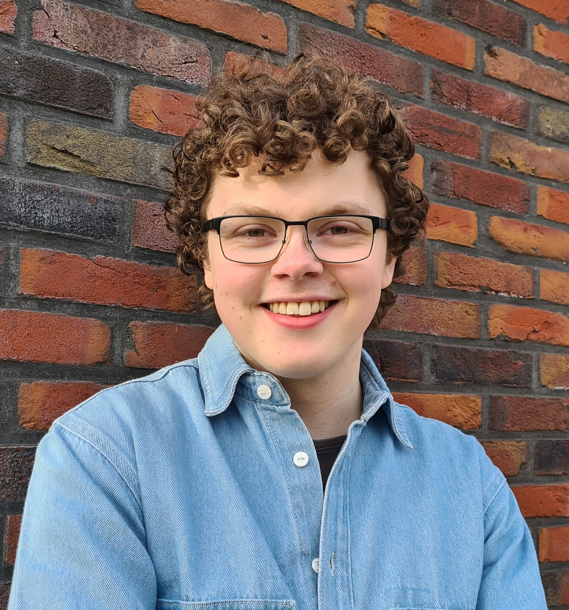

I am a PhD student in Operations Research at Tilburg University. I am interested in mathematics, statstics, programming (especially game playing agents) and chess.

This website hosts my CV, a list of my projects and a blog.
